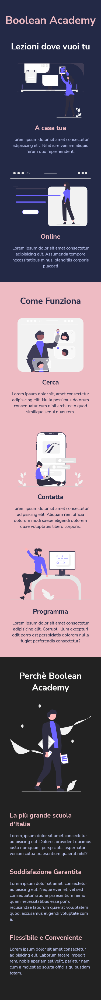

 
Undicesimo Esercizio Classe #137 - Boolean

---

Studente: Fabio Ferrero

---
# English

## Target of the project:
Use the @media queries in the CSS code to adapt the provided page layout to various display sizes

---
# Italiano

## Obiettivo del progetto:
Utilizzare le @media query nel codice CSS per adattare il layout della pagina fornita alle varie dimensioni di display

---

---

---
<strong>Gli screenshot forniti dal coach sono i seguenti:</strong>

Desktop view:

Tablet view:

Mobile view:  

